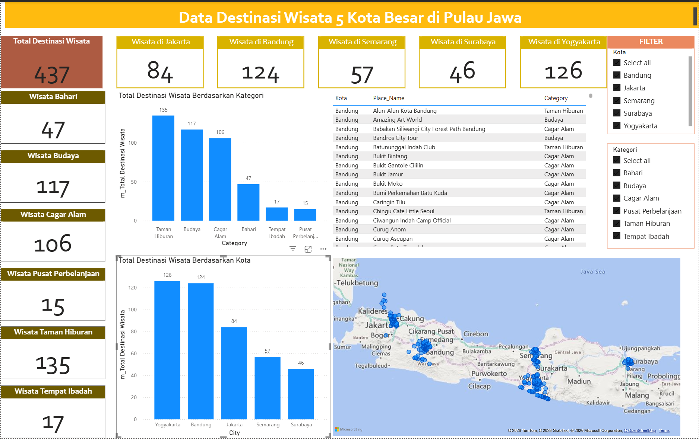
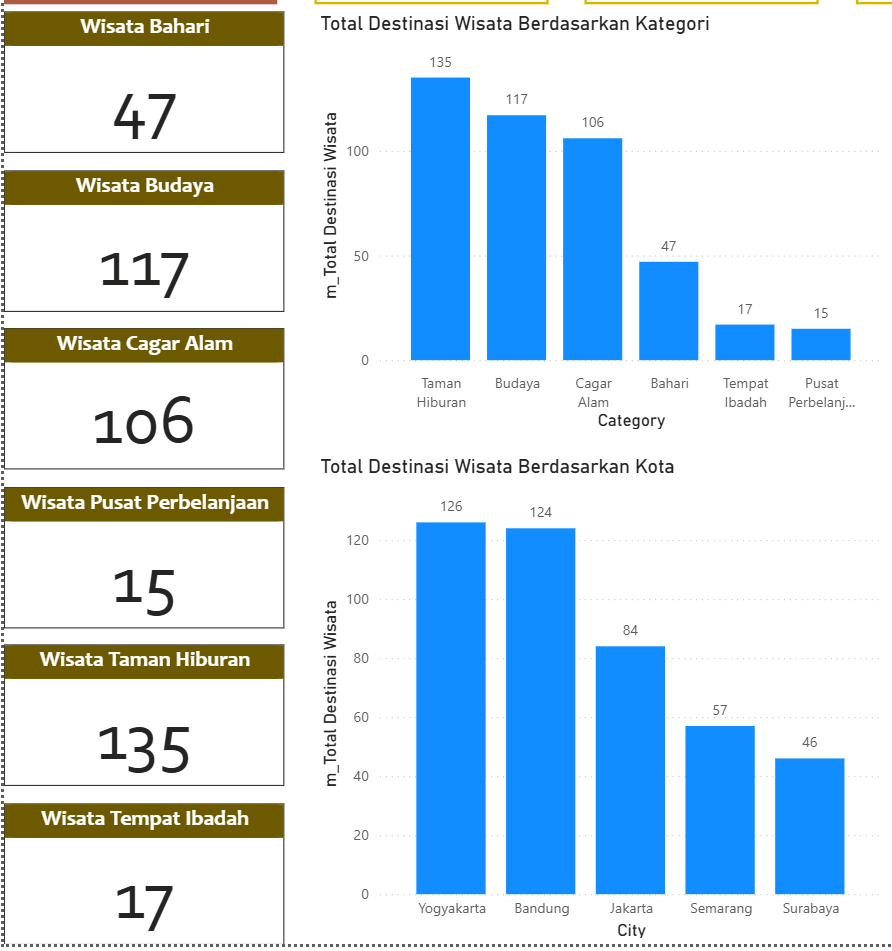
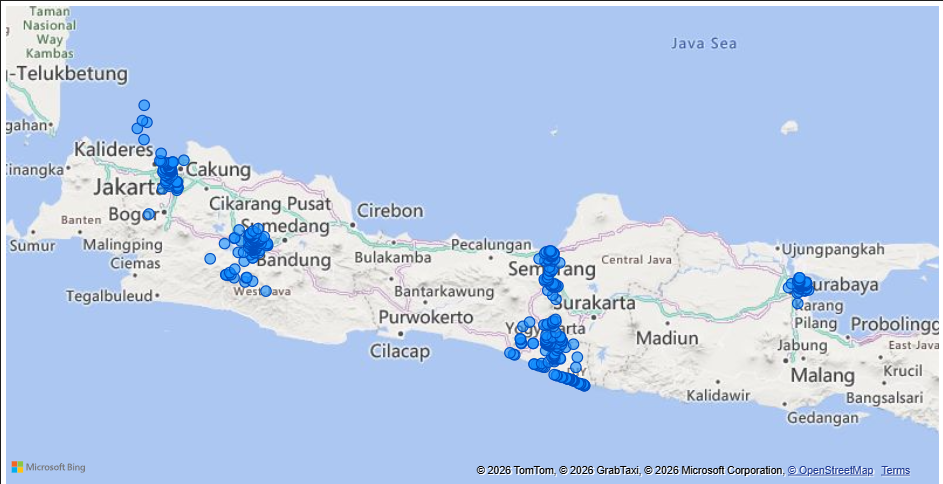

# Analisis Destinasi Wisata 5 Kota Besar di Pulau Jawa

## Latar Belakang
Pariwisata merupakan sektor penting dalam pengembangan ekonomi daerah. 
Project ini bertujuan untuk menganalisis persebaran destinasi wisata berdasarkan kota dan kategori di Pulau Jawa.

## Objective
- Mengetahui total destinasi wisata berdasarkan kota dan kategori
- Mengidentifikasi Top 3 destinasi wisata per kota
- Menyajikan data dalam bentuk dashboard interaktif

## Dataset
Dataset berisi informasi:
- Kota
- Nama Destinasi
- Kategori Wisata
- Lokasi geografis

## Tools
- Power BI
- DAX
- Power Query

## Dashboard Views

### Overview Dashboard

### Top 3 Destinasi Paling Banyak Dikunjungi

### Distribusi Kategori Wisata

### Persebaran Lokasi Wisata

## Insight Utama
- Kota dengan destinasi terbanyak: **Yogyakarta**
- Kategori paling dominan: **Taman Hiburan**
- Sebaran destinasi terkonsentrasi di wilayah perkotaan

## Insight & Recommendation

### Insight
- Yogyakarta dan Bandung memiliki jumlah kunjungan tertinggi dibanding kota lain
- Wisata Taman Hiburan dan Cagar Alam menjadi kategori yang paling banyak dikunjungi
- Destinasi dengan kunjungan tertinggi terkonsentrasi di pusat kota dan area wisata populer

### Recommendation
- Pemerintah daerah dapat memprioritaskan pengembangan infrastruktur di destinasi dengan kunjungan tinggi
- Promosi wisata dapat difokuskan pada kategori dengan potensi kunjungan besar
- Destinasi dengan kunjungan rendah dapat dikembangkan melalui event atau promosi digital

## File
- Dashboard Power BI: `/dashboard/wisata_jawa.pbix`
- Dataset: `/data/`

Dataset source: Kaggle (for educational and portfolio purposes)

